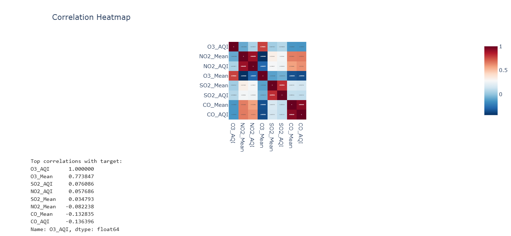
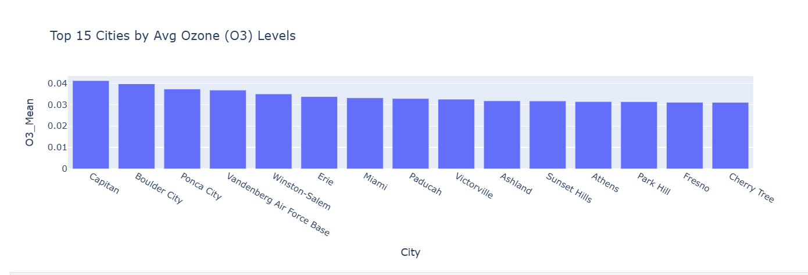

# Air Quality & Pollution Prediction  

**Prepared for:** UMBC Data Science Master Degree Capstone by Dr. Chaojie (Jay) Wang  
**Author:** Sai Nithin Reddy Kasireddy  
**GitHub Repo:** [UMBC-DATA606-Capstone](https://github.com/ksainithin/UMBC-DATA606-Capstone/tree/main)  
**LinkedIn Profile:** [Sai Nithin Reddy Kasireddy](https://www.linkedin.com/in/sai-nithin-reddy-1405b2220/)  
**PowerPoint Presentation:** [to be added later]  
**YouTube Video:** [to be added later]  

---

## 1. Background  

### What is it about?  
Air pollution is a critical global issue, impacting both **environmental sustainability** and **public health**. Pollutants like **PM2.5, PM10, NO2, and O3** are linked to respiratory illnesses, cardiovascular diseases, and premature deaths. This project aims to **predict pollutant levels in European cities** using historical air quality and weather data.  

### Why does it matter?  
Accurate predictions of air pollution can:  
- Enable governments and organizations to **issue health alerts** and protect vulnerable populations.  
- Help **urban planners and policymakers** design strategies to reduce emissions.  
- Provide **citizens with real-time insights** to make safer choices (e.g., outdoor activities).  

### Research Questions  
1. Can we accurately predict pollutant levels in European cities using historical air quality and weather data?  
2. Which environmental and meteorological factors most influence air pollution?  
3. Can we build an **interactive visualization tool** to forecast pollution levels in real time?  

---

## 2. Data  

### Data Sources  
- **Primary Dataset:** https://drive.google.com/file/d/15MnMJKjqzyWBcMvy1iBaxUspl_s4_-be/view?usp=sharing  
  

### Data Size  
- ~400 MB (compressed CSV files)  

### Data Shape  
- **Rows:** ~1048576 records  
- **Columns:** 28
  

### Row Representation  
Each row represents an **daily measurement** of air quality and meteorological factors in a specific city.  

---

## Data Dictionary  

| Column Name  | Data Type   | Definition                          | Potential Values / Notes       | Use in ML Model |
|--------------|------------|-------------------------------------|--------------------------------|-----------------|
| city         | Categorical | Name of the city                   | e.g., Paris, Berlin, London    | Feature         |
| datetime     | Datetime    | Timestamp of measurement           | YYYY-MM-DD HH:MM               | Feature         |
| PM2.5        | Numeric     | Fine particulate matter (µg/m³)     | Continuous values              | Target          |
| PM10         | Numeric     | Coarse particulate matter (µg/m³)   | Continuous values              | Target          |
| NO2          | Numeric     | Nitrogen Dioxide (µg/m³)           | Continuous values              | Target          |
| O3           | Numeric     | Ozone (µg/m³)                      | Continuous values              | Target          |
| CO           | Numeric     | Carbon Monoxide (mg/m³)            | Continuous values              | Feature         |
| SO2          | Numeric     | Sulfur Dioxide (µg/m³)             | Continuous values              | Feature         |
| temperature  | Numeric     | Air temperature (°C)               | Continuous values              | Feature         |
| humidity     | Numeric     | Relative humidity (%)              | Continuous values              | Feature         |
| wind_speed   | Numeric     | Wind speed (m/s)                   | Continuous values              | Feature         |
| pressure     | Numeric     | Atmospheric pressure (hPa)         | Continuous values              | Feature         |

---

### Target Variables  
- **PM2.5, PM10, NO2, O3**  

### Feature Variables / Predictors  
- **city, datetime (converted to hour/day/month), temperature, humidity, wind_speed, pressure, CO, SO2**  

## 4.1 Overview  

This section presents the **Exploratory Data Analysis (EDA)** conducted for the *Air Quality & Pollution Prediction* project.  
The objectives are to  

- assess data quality and structure,  
- study pollutant relationships and seasonal behavior,  
- detect missing values, outliers, and duplicates, and  
- confirm that the dataset is “tidy” and modeling-ready.  

---

## 4.2 Dataset Summary  

After cleaning and removing unnecessary identifiers (`State Code`, `County Code`, `Site Num`, `Address`), the dataset contains:

| Metric | Value |
|--------|--------|
| **Rows** | 1 ,048 ,576 |
| **Columns** | 24 |
| **Key Variables** | `O3_AQI`, `NO2_Mean`, `NO2_AQI`, `O3_Mean`, `SO2_Mean`, `SO2_AQI`, `CO_Mean`, `CO_AQI` |
| **Date Range** | 2000 – 2010 |
| **Granularity** | Daily pollutant readings per city/station |

Each record corresponds to one day’s pollutant measurements at a monitoring location.

---

## 4.3 Data Cleaning  

- Dropped redundant index/location columns.  
- Renamed headers for consistency (e.g., `O3 Mean` → `O3_Mean`).  
- Converted `Date_Local` to datetime format.  
- Removed **2 ,407 duplicate rows**.  
- Verified that each row = one observation and each column = one variable.  

✅ **Dataset is tidy and ready for modeling.**

---

## 4.4 Missing Values  

| Column | Missing Values |
|---------|----------------|
| `CO_AQI` | 524 ,224 |
| `SO2_AQI` | 524 ,487 |
| Other numeric fields | ≤ 1 |

> **Observation:** Missingness is concentrated in `CO_AQI` and `SO2_AQI` (~50 %).  
These will later be filled using median or pollutant-specific imputation.

---

## 4.5 Summary Statistics  

| Variable | Mean | Std | Min | 25 % | 50 % | 75 % | Max |
|-----------|------|-----|-----|------|------|------|-----|
| **O3_AQI** | 36.07 | 20.87 | 0 | 25 | 33 | 42 | 211 |
| **NO2_Mean** | 14.47 | 10.03 | 0 | 7.09 | 12.50 | 19.75 | 139.54 |
| **SO2_Mean** | 2.49 | 3.22 | –0.45 | 0.46 | 1.43 | 3.29 | 321.63 |
| **CO_Mean** | 0.42 | 0.36 | 0.20 | 0.20 | 0.34 | 0.54 | 7.51 |

Pollutant variables exhibit **right-skewed distributions**, consistent with environmental readings that spike during specific pollution events.

---

## 4.6 Visual Exploration  

### (a) Distribution of O₃ AQI

- Right-skewed histogram; long upper tail indicates occasional high-pollution days.  
- Boxplot confirms multiple outliers.

---

### (b) Correlation Analysis

| Top Correlations with O₃_AQI | r-value |
|-------------------------------|-----------|
| **O3_Mean** | 0.77 |
| **SO2_AQI** | 0.08 |
| **NO2_AQI** | 0.06 |
| **SO2_Mean** | 0.03 |
| **CO_AQI** | –0.13 |

> `O3_Mean` shows the strongest correlation with the target, as expected.  
> Slight negative correlation with `CO_AQI` suggests ozone rises under low-CO (sunny) conditions.

---

### (c) Scatter Matrix  

- `O3_AQI` has nonlinear relationships with other pollutants.  
- Dense clusters near the origin represent clean-air periods; sparse outliers denote smog events.

---

### (d) Time-Series Trend  

- Clear **seasonal oscillations** with annual peaks in warmer months.  
- Indicates **temperature and sunlight** strongly influence ozone formation.

---

## 4.7 Outlier Detection  

| Variable | Outlier Count |
|-----------|--------------|
| SO2_Mean | 69 ,125 |
| O3_AQI | 67 ,264 |
| CO_Mean | 56 ,414 |
| SO2_AQI | 45 ,461 |
| CO_AQI | 27 ,753 |
| NO2_Mean | 27 ,190 |
| NO2_AQI | 16 ,250 |
| O3_Mean | 4 ,584 |

Outliers correspond to **short-term pollution spikes** and will be treated using winsorization or log-transformation.

---

## 4.8 City-Level Insights  

- **Capitan**, **Boulder City**, and **Ponca City** record the highest ozone means.  
- Southwestern regions display elevated values due to higher solar radiation and temperature.

---

## 4.9 Data Tidiness  

- Each record = unique (city × date) observation.  
- Each variable occupies a distinct column.  
- Dataset passes all tidy-data checks.  

✅ **Final structure is clean and analysis-ready.**

---

## 4.10 Data Augmentation Opportunities  

| Source | Description | Join Key |
|---------|--------------|-----------|
| NOAA Weather Data | Temperature, humidity, wind speed | City + Date |
| U.S. Census Data | Population density, socioeconomic factors | County + State |
| EPA Emission Inventory | Industrial emission rates | County |
| Satellite MODIS | Aerosol Optical Depth (AOD) | Spatial grid + Date |

Such external datasets will enrich spatial and meteorological context.

---

## 4.11 Conclusions  

- Dataset spans **2000 – 2010**, offering a decade-long air-quality record.  
- `O3_AQI` selected as the primary **target variable**.  
- High **multicollinearity** among pollutant metrics → feature-reduction planned.  
- Outlier and missing-value handling defined for preprocessing.  
- Seasonal and geographic trends highlight strong potential for **time-series + spatial modeling**.

---

## 4.12 Next Steps  

1. Engineer temporal and rolling-window features.  
2. Train regression and time-series models (Random Forest, XGBoost, LSTM).  
3. Evaluate using MAE, RMSE, and R².  
4. Develop an interactive visualization dashboard (Streamlit / Plotly Dash).

---

**End of Section 4 – Exploratory Data Analysis (EDA)**  
*Prepared by Sai Nithin Reddy Kasireddy, UMBC MS Data Science Capstone 2025*
