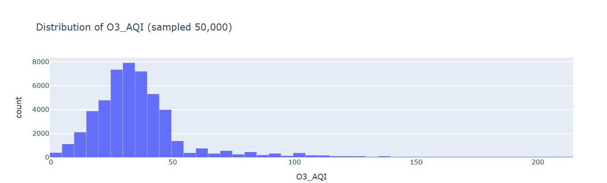
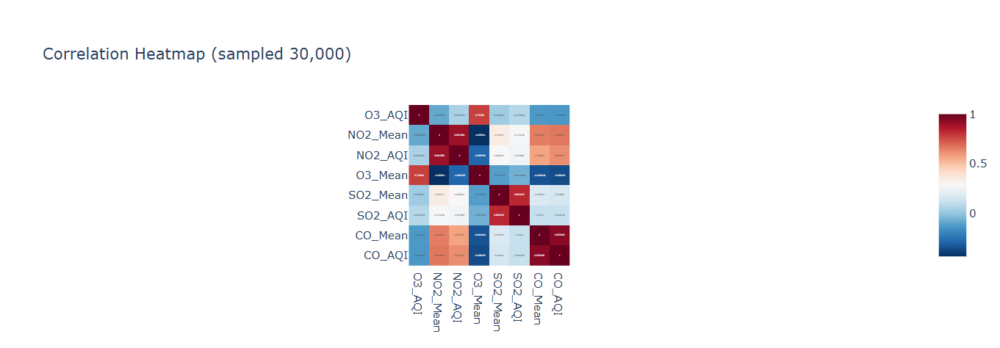
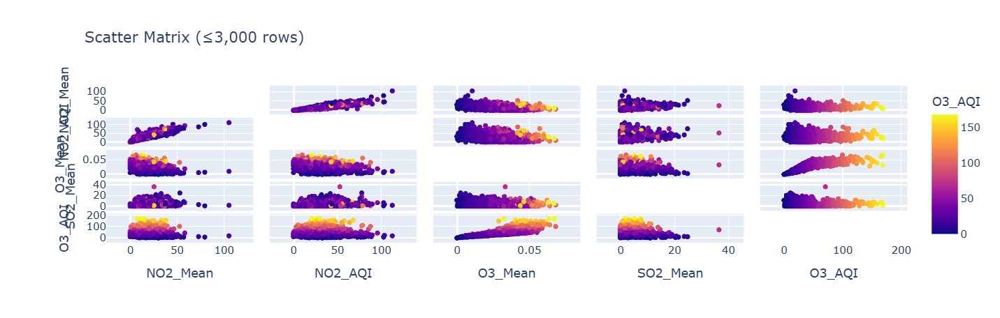
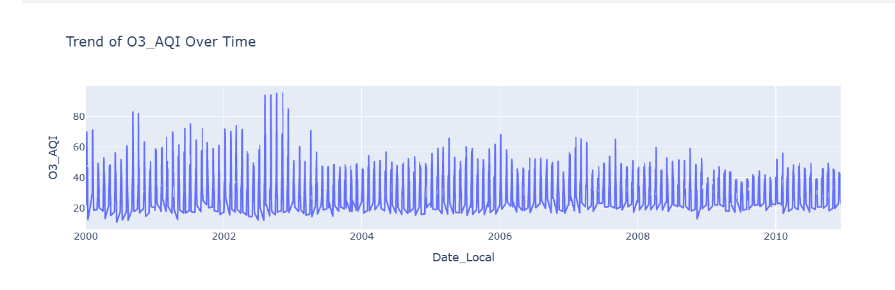
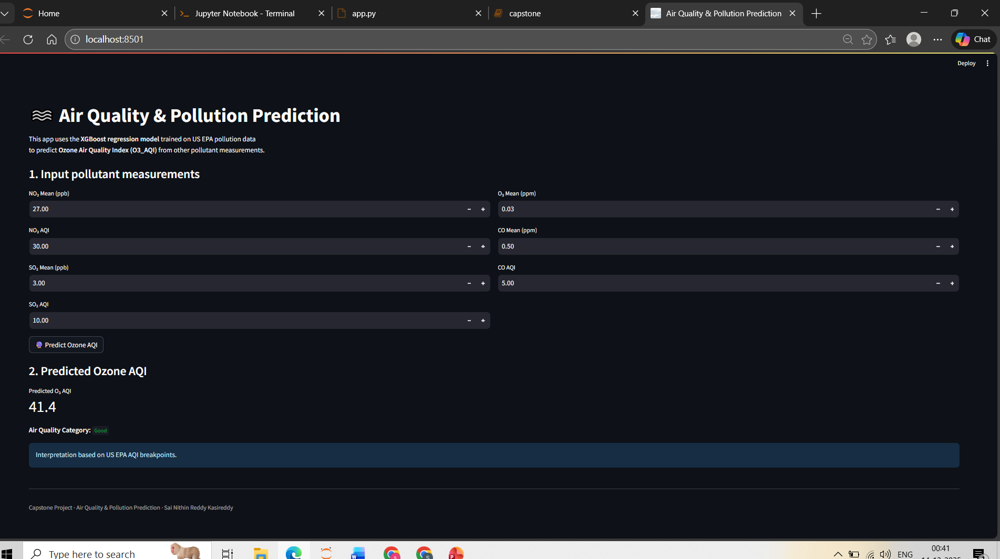

# 🌫️ Air Quality & Pollution Prediction

**Sai Nithin Reddy Kasireddy**  
**Fall 2025 – UMBC DATA 606 Capstone Project**

---

## 🔗 Project Links

- **GitHub Repository:**  
  https://github.com/ksainithin/UMBC-DATA606-Capstone  

- **Final Presentation (PPT):**  
  (https://docs.google.com/presentation/d/1PrX6BFbLnjih8sqxg9V1BBPYnKJ0Oui7/edit?usp=sharing&ouid=110232658572728554686&rtpof=true&sd=true) 

- **YouTube Presentation Video:**  
  *(https://youtu.be/yHczr8uCqT8)*  

---

## 1. Background

Air pollution is a serious global environmental and public health issue. Pollutants such as ozone (O₃), nitrogen dioxide (NO₂), sulfur dioxide (SO₂), and carbon monoxide (CO) are associated with respiratory illnesses, cardiovascular diseases, and increased mortality rates.

Ground-level ozone is especially harmful because it forms through chemical reactions between pollutants under sunlight and directly affects air quality in urban environments. Accurate prediction of ozone levels can help governments, healthcare agencies, and individuals take preventive actions.

The objective of this project is to predict **Ozone Air Quality Index (O₃_AQI)** using historical air pollution data and machine learning regression models, and to deploy the best-performing model through an interactive web application.

---

## 2. Data Sources

- **Primary Dataset:**  
  United States Environmental Protection Agency (EPA) Air Quality Dataset  
  https://drive.google.com/file/d/15MnMJKjqzyWBcMvy1iBaxUspl_s4_-be/view  

- **Dataset Overview:**  
  - Time period: 2000–2016  
  - Geographic scope: United States  
  - Size: ~1,048,576 records with 29 columns  

Each row represents daily pollutant measurements recorded at air quality monitoring stations.

---

## 3. Data Elements

### Target Variable
- **O₃_AQI** – Ozone Air Quality Index (continuous numerical variable)

### Feature Variables
- NO₂_Mean – Average nitrogen dioxide concentration  
- NO₂_AQI – Nitrogen dioxide AQI  
- O₃_Mean – Average ozone concentration  
- SO₂_Mean – Average sulfur dioxide concentration  
- SO₂_AQI – Sulfur dioxide AQI  
- CO_Mean – Average carbon monoxide concentration  
- CO_AQI – Carbon monoxide AQI  

### Data Preparation
- Removed irrelevant identifiers and location fields
- Converted date fields to datetime format
- Handled missing values
- Ensured clean, structured data for modeling

---

## 4. Exploratory Data Analysis (EDA)

EDA was conducted to understand data distribution and feature relationships.

- **Distribution Analysis:**  
  Histograms and boxplots of O₃_AQI show a right-skewed distribution with occasional extreme pollution values.

  

- **Correlation Analysis:**  
  O₃_Mean shows the strongest positive correlation with O₃_AQI, validating its importance as a predictor.

  

- **Scatter Matrix:**  
  Scatter plots indicate mostly linear relationships between features and the target variable.
  

- **Time-Series Trend:**  
  O₃_AQI exhibits seasonal patterns and a gradual long-term decline, reflecting environmental regulations and policy impacts.
  

---

## 5. Machine Learning Models

### Models Used
- Dummy Regressor (baseline)
- Linear Regression
- Ridge Regression
- Lasso Regression
- Random Forest Regressor
- Histogram-Based Gradient Boosting
- XGBoost Regressor

### Training Strategy
- Train-test split: 80% training, 20% testing
- Feature scaling applied where required
- Evaluation metrics:
  - Mean Absolute Error (MAE)
  - Root Mean Squared Error (RMSE)
  - R² Score

### Model Performance Summary

| Model | MAE | RMSE | R² |
|------|-----|------|----|
| XGBoost | 4.63 | 7.50 | 0.77 |
| HistGradientBoosting | 4.66 | 7.50 | 0.77 |
| Random Forest | 4.81 | 7.67 | 0.76 |
| Linear / Ridge / Lasso | ~6.86 | ~9.39 | ~0.64 |
| Dummy Regressor | 11.52 | 16.24 | -0.06 |

XGBoost achieved the best overall performance and was selected as the final model.

---

## 6. Application of the Trained Model

A Streamlit web application was developed to allow users to interact with the trained model.

### Application Features
- User-friendly input fields for pollutant values
- Real-time O₃_AQI prediction using XGBoost
- Automatic mapping of predictions to EPA AQI health categories
- Designed for non-technical users

  

### Tools Used
- Streamlit
- scikit-learn
- XGBoost
- Pandas
- Joblib

---

## 7. Conclusion

This project demonstrates how machine learning can be applied to environmental data to predict air quality indicators. Through extensive EDA, model comparison, and deployment, the project highlights the practical value of regression models in environmental analytics.

The XGBoost regression model provided the highest predictive accuracy and was successfully deployed in an interactive web application.

---

## 8. Limitations

- Dataset limited to United States monitoring stations
- Meteorological variables were not included
- Spatial dependencies were not modeled
- Predictions should not be used as official health advisories

---

## 9. Future Research Directions

- Incorporate weather variables such as temperature, humidity, and wind speed
- Extend the dataset to global air quality sources
- Use deep learning models (e.g., LSTM) for time-series forecasting
- Deploy the application to cloud platforms
- Add geographic visualizations and dashboards

---

